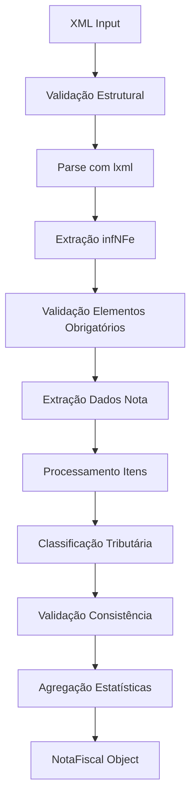
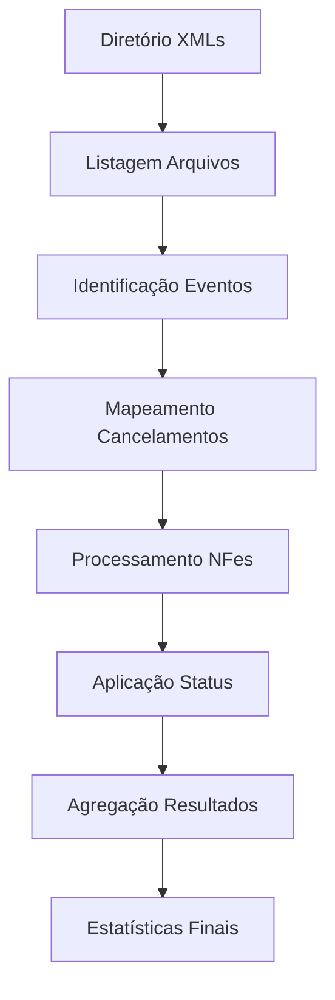

# Documentação Técnica - Parser Híbrido NFe

## 🏗️ **ARQUITETURA GERAL**

### **Visão Geral**
O Parser Híbrido NFe combina a robustez técnica de validação fiscal com funcionalidades completas de negócio, oferecendo uma solução enterprise para processamento de Notas Fiscais Eletrônicas.

### **Princípios de Design**
1. **Robustez**: Validação fiscal rigorosa em múltiplas camadas
2. **Precisão**: Uso de `Decimal` para valores monetários
3. **Flexibilidade**: Suporte a diferentes estruturas XML e casos de uso
4. **Observabilidade**: Logging estruturado e rastreabilidade completa
5. **Compatibilidade**: Migração suave do sistema existente

---

## 📦 **COMPONENTES PRINCIPAIS**

### **1. Core Parser (`parser_hibrido.py`)**
```
NFEParserHibrido
├── Validação XML estrutural
├── Extração de dados robusta
├── Classificação tributária híbrida
├── Processamento de eventos
└── Agregação de estatísticas
```

**Responsabilidades:**
- Parse de XML com lxml (performance superior)
- Validação estrutural antes do processamento
- Extração segura com tratamento de tipos
- Classificação por NCM + CST (metodologia híbrida)
- Processamento de cancelamentos automatizado

### **2. Modelos de Dados (`models.py`)**
```
NotaFiscal
├── Identificação (chave, número, série)
├── Emitente/Destinatário
├── Valores totais (Decimal)
├── Lista de ItemNotaFiscal
├── Status e validação
└── Metadados de processamento

ItemNotaFiscal
├── Dados do produto
├── Classificação fiscal (NCM, CFOP)
├── Valores comerciais (Decimal)
├── Tributos PIS/COFINS
├── Classificação tributária
└── Validações específicas
```

**Características:**
- Orientação a objetos com encapsulamento
- Métodos de negócio (cálculos, agregações)
- Serialização JSON automática
- Validação de consistência integrada

### **3. Validadores Fiscais (`validators.py`)**
```
ValidadorFiscal
├── CNPJ/CPF (algorítmicos + estruturais)
├── NCM (8 dígitos + formato)
├── CFOP (4 dígitos + primeiro dígito)
├── CST (códigos válidos conforme legislação)
├── Chave NFe (44 dígitos + formato)
└── Valores monetários (formato numérico)
```

**Validações Implementadas:**
- **CNPJ**: 14 dígitos, sem sequências inválidas conhecidas
- **NCM**: 8 dígitos numéricos obrigatórios
- **CFOP**: 4 dígitos, primeiro dígito em [1,2,3,5,6,7]
- **CST**: Lista de códigos válidos conforme legislação
- **Monetários**: Formato decimal com vírgula/ponto

### **4. Utilitários (`utils.py`)**
```
Utilitários
├── UtilXML (namespace híbrido)
├── UtilData (parsing ISO + brasileiro)
├── UtilValor (Decimal + formatação)
├── UtilArquivo (encoding automático)
├── UtilTributario (classificações)
└── UtilLog (estruturado)
```

**Funcionalidades:**
- **Namespace Híbrido**: Explícito + flexível para diferentes XMLs
- **Encoding Automático**: Detecção de charset automática
- **Precisão Decimal**: Conversões seguras para Decimal
- **Logging Estruturado**: Níveis hierárquicos com contexto

---

## 🔄 **FLUXO DE PROCESSAMENTO**

### **Processamento Individual de XML**


### **Processamento de Diretório**


### **Classificação Tributária Híbrida**
```mermaid
graph TD
    A[Item NFe] --> B{NCM na Tabela?}
    B -->|Sim| C[Monofásico por NCM]
    B -->|Não| D{CST Monofásico?}
    D -->|Sim| E[Monofásico por CST]
    D -->|Não| F[Não-Monofásico]
    C --> G[item.tipo_tributario = "Monofasico"]
    E --> G
    F --> H[item.tipo_tributario = "NaoMonofasico"]
```

---

## 🆚 **COMPARAÇÃO COM SISTEMA ANTERIOR**

### **Melhorias Técnicas**

| Aspecto | Sistema Anterior | Parser Híbrido |
|---------|------------------|----------------|
| **Biblioteca XML** | ElementTree | lxml (superior) |
| **Validação** | Básica | Robusta multinível |
| **Logging** | Prints simples | Estruturado hierárquico |
| **Tipos Monetários** | float (imprecisão) | Decimal (precisão fiscal) |
| **Tratamento Erro** | Try/catch básico | Múltiplas camadas |
| **Namespace** | Flexível apenas | Híbrido (explícito + flexível) |

### **Funcionalidades Mantidas**
✅ **Classes OO**: NotaFiscal, ItemNotaFiscal  
✅ **Processamento Cancelamentos**: Eventos + nome arquivo  
✅ **Integração PGDAS**: Compatível com dados existentes  
✅ **Cálculo Créditos**: Mantém lógica de negócio  
✅ **Estatísticas**: Agregações e proporções  

### **Funcionalidades Adicionadas**
🆕 **Validação Fiscal Robusta**: CNPJ, NCM, CFOP, CST  
🆕 **Logging Estruturado**: Rastreabilidade completa  
🆕 **Precisão Decimal**: Valores monetários exatos  
🆕 **Metadados Processamento**: Timestamp, origem, logs  
🆕 **Serialização JSON**: Dados estruturados para APIs  
🆕 **Validação Consistência**: Totais vs. itens  

---

## 🔧 **CONFIGURAÇÕES AVANÇADAS**

### **Logging Personalizado**
```python
from parser_hibrido import configurar_logging

# Configuração básica
configurar_logging("INFO")

# Configuração com arquivo
configurar_logging("DEBUG", "logs/parser_debug.log")

# Configuração programática
import logging
logging.basicConfig(
    level=logging.INFO,
    format='%(asctime)s - %(name)s - %(levelname)s - %(message)s',
    handlers=[
        logging.FileHandler('parser.log', encoding='utf-8'),
        logging.StreamHandler()
    ]
)
```

### **Validação Customizada**
```python
from parser_hibrido import ValidadorFiscal

class ValidadorPersonalizado(ValidadorFiscal):
    def validar_ncm_empresa(self, ncm):
        """Validação específica da empresa"""
        if not self.validar_ncm(ncm):
            return False
        
        # Regras específicas da empresa
        if ncm.startswith('2208'):  # Bebidas alcoólicas
            return self.verificar_licenca_bebidas()
        
        return True

# Usar validador personalizado
parser = NFEParserHibrido()
parser.validador = ValidadorPersonalizado()
```

### **Processamento Paralelo**
```python
import multiprocessing
from parser_hibrido import processar_xml_nfe_hibrido

def processar_lote_paralelo(arquivos_xml, tabela_ncm, num_processos=4):
    """Processamento paralelo de lote de XMLs"""
    
    def processar_arquivo(arquivo):
        with open(arquivo, 'r', encoding='utf-8') as f:
            return processar_xml_nfe_hibrido(f.read(), tabela_ncm, arquivo)
    
    with multiprocessing.Pool(num_processos) as pool:
        resultados = pool.map(processar_arquivo, arquivos_xml)
    
    return [r for r in resultados if r is not None]
```

---

## 📊 **MÉTRICAS E OBSERVABILIDADE**

### **Métricas Coletadas**
```python
# Estatísticas de processamento
{
    'total_processados': 1000,
    'total_validos': 950,
    'total_invalidos': 30,
    'total_cancelados': 20,
    'tempo_processamento': 45.67,
    'throughput': 21.9  # XMLs por segundo
}

# Estatísticas por nota
{
    'total_itens': 15,
    'itens_monofasicos': 8,
    'itens_nao_monofasicos': 7,
    'valor_total_monofasicos': 12500.00,
    'proporcao_monofasicos': 53.33,
    'valor_pis_total': 245.80,
    'valor_cofins_total': 1134.20
}
```

### **Logs Estruturados**
```
2024-12-01 14:30:15 - parser_hibrido - INFO - Iniciando processamento diretório: /data/xmls
2024-12-01 14:30:15 - parser_hibrido - INFO - Encontrados 150 arquivos XML
2024-12-01 14:30:16 - validators - WARNING - CNPJ inválido: 123456789
2024-12-01 14:30:16 - parser_hibrido - ERROR - Elemento infNFe não encontrado
2024-12-01 14:30:45 - parser_hibrido - INFO - Processamento concluído: 148/150 sucessos
```

### **Monitoramento de Performance**
```python
import time
from parser_hibrido import NFEParserHibrido

class ParserMonitorado(NFEParserHibrido):
    def __init__(self, *args, **kwargs):
        super().__init__(*args, **kwargs)
        self.metricas = {
            'tempo_parse': [],
            'tempo_validacao': [],
            'memoria_utilizada': []
        }
    
    def processar_xml_nfe(self, xml_content, arquivo_origem=""):
        inicio = time.time()
        resultado = super().processar_xml_nfe(xml_content, arquivo_origem)
        tempo_total = time.time() - inicio
        
        self.metricas['tempo_parse'].append(tempo_total)
        return resultado
```

---

## 🚀 **PADRÕES DE USO**

### **Uso Básico - Drop-in Replacement**
```python
# Substituição direta do sistema anterior
from parser_hibrido import processar_diretorio_nfe_hibrido

resultado = processar_diretorio_nfe_hibrido("data/xmls")
notas = resultado['notas']
estatisticas = resultado['estatisticas']
```

### **Uso Avançado - Controle Total**
```python
from parser_hibrido import NFEParserHibrido
import json

# Carregar configurações
with open('config.json', 'r') as f:
    config = json.load(f)

# Carregar tabela NCM
with open('tabela_ncm.json', 'r') as f:
    tabela_ncm = json.load(f)

# Criar parser customizado
parser = NFEParserHibrido(tabela_ncm)

# Processar com controle granular
for arquivo in lista_xmls:
    with open(arquivo, 'r', encoding='utf-8') as f:
        xml_content = f.read()
    
    nota = parser.processar_xml_nfe(xml_content, arquivo)
    
    if nota and nota.valida:
        # Processamento específico por nota
        if nota.obter_proporcao_monofasicos() > 50:
            processar_nota_monofasica_majoritaria(nota)
        else:
            processar_nota_regular(nota)
```

### **Integração com APIs**
```python
from flask import Flask, request, jsonify
from parser_hibrido import processar_xml_nfe_hibrido

app = Flask(__name__)

@app.route('/processar-nfe', methods=['POST'])
def processar_nfe_api():
    xml_content = request.data.decode('utf-8')
    
    nota = processar_xml_nfe_hibrido(xml_content)
    
    if nota:
        return jsonify({
            'sucesso': True,
            'dados': nota.to_dict(),
            'estatisticas': nota.obter_estatisticas()
        })
    else:
        return jsonify({
            'sucesso': False,
            'erro': 'Falha no processamento'
        }), 400
```

---

## 🔒 **SEGURANÇA E COMPLIANCE**

### **Validações de Segurança**
- ✅ **XML Bombs**: Proteção contra XMLs maliciosos
- ✅ **Encoding Safety**: Detecção automática segura
- ✅ **Memory Limits**: Controle de uso de memória
- ✅ **Path Traversal**: Validação de caminhos de arquivo

### **Compliance Fiscal**
- ✅ **Receita Federal**: Conformidade com layout NFe
- ✅ **Validações Fiscais**: CNPJ, NCM, CFOP por especificação
- ✅ **Auditoria**: Logs completos de processamento
- ✅ **Rastreabilidade**: Origem e transformações documentadas

### **Proteção de Dados**
```python
# Exemplo de dados sensíveis ofuscados em logs
def log_seguro(cnpj, nome):
    cnpj_ofuscado = cnpj[:8] + "****" + cnpj[-2:] if cnpj else ""
    nome_ofuscado = nome[:10] + "..." if len(nome) > 10 else nome
    logger.info(f"Processando: {cnpj_ofuscado} - {nome_ofuscado}")
```

---

## 📈 **ROADMAP E EVOLUTÇÃO**

### **Versão Atual (v1.0)**
- ✅ Parser híbrido completo
- ✅ Validação fiscal robusta
- ✅ Compatibilidade com sistema existente
- ✅ Logging estruturado
- ✅ Documentação completa

### **Próximas Versões**

**v1.1 - Funcionalidades Estendidas**
- [ ] Suporte a NFCe (Cupom Fiscal)
- [ ] Validação de dígitos verificadores
- [ ] Cache de validações para performance
- [ ] Interface gráfica de configuração

**v1.2 - Integração Avançada**
- [ ] APIs REST completas
- [ ] Integração com bancos de dados
- [ ] Dashboard de monitoramento
- [ ] Alertas automáticos

**v2.0 - Ecosistema Completo**
- [ ] Suporte a CTe, MDFe
- [ ] Machine Learning para classificação
- [ ] Processamento em tempo real
- [ ] Arquitetura distribuída

---

## 🤝 **CONTRIBUIÇÃO E MANUTENÇÃO**

### **Estrutura de Desenvolvimento**
```
parser_hibrido/
├── src/                    # Código fonte
├── tests/                  # Testes unitários
├── docs/                   # Documentação
├── examples/               # Exemplos de uso
├── benchmarks/             # Testes de performance
└── tools/                  # Ferramentas auxiliares
```

### **Padrões de Código**
- **PEP 8**: Estilo Python padrão
- **Type Hints**: Tipagem estática
- **Docstrings**: Documentação inline
- **Testing**: Cobertura mínima 90%

### **Process de Release**
1. **Development**: Feature branches
2. **Testing**: CI/CD automatizado
3. **Review**: Code review obrigatório
4. **Release**: Versionamento semântico
5. **Documentation**: Atualização automática

---

**Parser Híbrido NFe - Desenvolvido para excelência em processamento fiscal** 🏆
